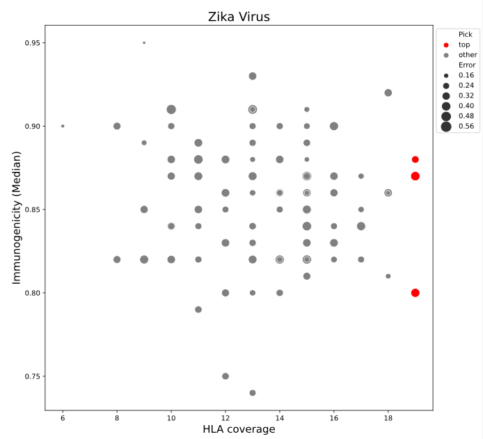

# HLAoptimize
A module to test ranking and optimizing HLA coverage of vaccine elements. 

## Introduction
This repository contains an example project to find optimal vaccine elements according to specific criteria involving HLA coverage. In particular, following analyses are considered for this problem:
- **Maximized HLA coverage**: Here, vaccine elements are ranked based on their HLA coverage, which is defined by a immunogenicity cut-off.
- **Minimal sets of vaccine elements**: Here, an optimization with genetic algorithms is performed that is finding a minimal set of vaccine elements, that optimize HLA coverage, immunigenicity, binding, error rate and coverage across viruses.

## Installation
- Clone this repository to get all the necessary code
- Navigate to the directory:
```
cd HLAoptimize
```
- To install the CLI and associated functions run:
```
python setup.py develop
```

## Usage

### Maximized HLA coverage
To perform a ranking of vaccine elements that maximize the HLA coverage run:
```
HLAopti_cli 'exercise_data.csv' 'Zika Virus' 0.7 'test_output'
```
For help on the input run 
```
HLAopti_cli -h
```
which will give you the following information:

```
HLAoptimize euba$ HLAopti_cli -h
usage: HLAopti_cli [-h] input virus immunocut outdir

positional arguments:
  input       Specify input csv file with HLA data
  virus       Specify the virus you are interested in
  immunocut   Specify the cut-off value of Immunogenicity
  outdir      Specify an output directory for results

optional arguments:
  -h, --help  show this help message and exit
```

### Minimal sets of vaccine elements
To get an optimized minimum set of vaccine elements using a genetic algorithms with fixed weights run:
```
HLAoptiGA_cli 'exercise_data.csv' 0.7 'test_output'
```
For help on the input run 
```
HLAoptiGA_cli -h
```
which will give you the following information:
```
 HLAoptiGA_cli [-h] input immunocut outdir

positional arguments:
  input       Specify input csv file with HLA data
  immunocut   Specify the cut-off value of Immunogenicity
  outdir      Specify an output directory for results

optional arguments:
  -h, --help  show this help message and exit
```
In case you want to use a genetic algorithm with randomized weights you can use a similar command: 
```
HLAoptiGA_cli 'exercise_data.csv' 0.7 'test_output'
```

## Details

### Maximized HLA coverage
For suitable vaccine elements, the HLA coverage is calculated by selected HLAs with an user defined immunogenicity cut-off for a specific user defined virus. The resulting table is then ranked by HLA coverage (number of covered HLAs per vaccine element) and median immunigenicity score of the vaccine element.

The resulting table is then exported as .tsv file to an user defined output directory along with additional plots. The plot includes a bar chart with the HLA coverage per vaccine element of the seleted virus, in which top vaccine elements are highlighted in red. In addition a scatter plot shows the median immunogenicity over the HLA coverage, in which top vaccine elements are again highlighted in red and points are scaled by the error rate:



It is recommended to investigate to output plots and the ranked .tsv table to make a decision on which vaccine element might be best suited for further investigation.

### Minimal sets of vaccine elements

To find optimal sets of vaccine elements that satisfy different objective functions, a genetic algorithm is used for optimization. The following objective functions need to be satisfied:

- $iscore$: Maximize the sum of immogenicity score over all HLAs in a vaccine element over all viruses
- $binding$: Maximize the sum of Binding over all HLAs in a vaccine element over all viruses
- $1-error$: Minimize the overall error rate by maximizing the inverse
- $HLAcover$: Maximize the HLA coverage over all vaccine elements over all viruses
- $|vel_all| - |vel_sel|$: Minimize the set of selected vaccine elements as a maximization of the inverse size

